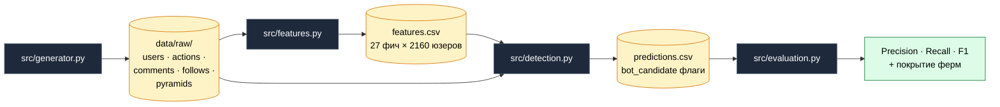

# Bot Farm Detector

> End-to-end пайплайн детекции координированных ботоферм в соцсети: от
> синтетических данных до итоговых метрик. Сделан как воплощение в код устного
> ответа на собеседовании на позицию **стажёра-аналитика антифрода**.

---

## TL;DR

В синтетическом датасете 2160 пользователей, из них 160 — боты, организованные
в 5 ферм. Они синхронно подписываются на финансовые пирамиды, оставляют шаблонные
комментарии, делятся IP-подсетями и взаимно подписаны друг на друга.

Два метода детекции работают параллельно:

| Метод | Precision | Recall | F1 |
|:--|:-:|:-:|:-:|
| **Louvain** на графе подписок и общих /24 подсетей | **1.000** | **1.000** | **1.000** |
| Combined (Louvain ∪ DBSCAN) | 0.856 | 1.000 | 0.922 |
| DBSCAN на поведенческих фичах | 0.325 | 0.081 | 0.130 |

Все 5 реальных ферм склеились в свои Louvain-сообщества (`dominant_share = 1.0`).

---

## Why this project

Кейс на собеседовании просил *описать словами*, как ловить ботов, подписавшихся
на финансовые пирамиды. После словесного ответа было желание собрать рабочий
артефакт — не просто рассуждать, а показать пайплайн end-to-end.

В отличие от стандартного Kaggle-ноутбука, проект решает три задачи параллельно:

1. **Реализм** — синтетика собрана так, чтобы воспроизводить настоящие паттерны
   ботоферм (синхронные залпы, шаблонные тексты, кольцевые подписки),
   а не просто рандом.
2. **Честность** — ground truth используется **только** для финальной оценки;
   обучение и кластеризация работают как на реальных данных, без меток.
3. **Сторителлинг** — ноутбуки построены вокруг гипотез из собеседного ответа.
   Часть гипотез ломается на этапе EDA — и это разобрано отдельно.

---

## Architecture



Внутри `detection.py` работают два независимых классификатора:

- **DBSCAN** — на стандартизованных поведенческих фичах. Помечает плотные группы;
  затем оставляем только малые кластеры (10–100 человек), большой = «нормальная масса».
- **Louvain** — на взвешенном графе, где рёбра это: (а) подписки между юзерами,
  (б) совместное использование одной /24-подсети. Маленькие сообщества с высоким
  средним `mutual_follow_share` и `duplicate_text_share` помечаются как фермы.

Финальный флаг `bot_candidate` = OR(DBSCAN-кандидат, Louvain-кандидат).

---

## Data

### Схема таблиц

| Таблица | Размер | Колонки |
|:--|:-:|:--|
| `users` | 2 160 | `user_id`, `registration_date`, `profile_completeness`, `has_avatar`, `is_bot`, `bot_cluster_id` |
| `actions` | 89 505 | `action_id`, `user_id`, `action_type` (subscribe / like / comment), `target_id`, `ts`, `ip`, `user_agent` |
| `comments` | 18 654 | `action_id`, `user_id`, `target_id`, `ts`, `text` |
| `follows` | 33 715 | `follower_id`, `followed_id`, `ts` |
| `pyramids` | 10 | `target_id`, `name`, `is_pyramid` |

Колонки `is_bot` и `bot_cluster_id` — ground truth, сгенерированный для оценки;
в обучении и кластеризации не используются.

### Заложенные паттерны ботоферм

| Паттерн в генераторе | Какой сигнал даёт |
|:--|:--|
| 5 кластеров ботов по 20–50 аккаунтов | Размер «подозрительных» Louvain-сообществ |
| Синхронная подписка на пирамиду в окне 5 минут | Всплеск во времени, низкий `min_window_5_sec` |
| Шаблонные комментарии (4 шаблона на ферму) | Высокий `duplicate_text_share` через MinHash |
| 2 общие /24-подсети на ферму | Совместные рёбра в графе Louvain |
| 3 общих User-Agent на ферму | Низкая энтропия UA на уровне фермы |
| Кольцевые подписки внутри фермы (≈70%) | Высокий `mutual_follow_share` |
| Регистрация в окне 14 дней перед атакой | Низкий `account_age_days` |
| Низкий `profile_completeness`, без аватара | Профильные фичи |

### Реалистичный шум

Часть нормальных пользователей (≈10%) тоже подписывается на пирамиды —
чтобы метрики не получились искусственно идеальными за счёт того, что *вообще
любая* активность на пирамиде = бот.

---

## Pipeline

| # | Модуль | Что делает |
|:-:|:--|:--|
| 1 | `src/generator.py` | 2160 пользователей, 89 тыс. действий, 5 ферм по ~30 ботов с заложенными паттернами |
| 2 | `src/features.py` | 27 фич по 5 группам: профиль, активность, технические, тексты (MinHash), граф |
| 3 | `src/detection.py` | DBSCAN + Louvain community detection, объединённые через OR |
| 4 | `src/evaluation.py` | Precision / Recall / F1 vs ground truth, покрытие каждой реальной фермы |

### Группы признаков

| Группа | Примеры | Что отражает |
|:--|:--|:--|
| Профиль | `profile_completeness`, `account_age_days`, `has_avatar` | Статика аккаунта |
| Активность | `pyramid_action_share`, `interval_median`, `min_window_5_sec` | Поведение во времени, бёрсты |
| Технические | `n_unique_subnets`, `ua_entropy`, `ip_entropy` | Концентрация устройств |
| Тексты | `duplicate_text_share`, `mean_text_neighbours` | MinHash-сходство комментариев |
| Граф | `mutual_follow_share`, `following_count`, `followers_count` | Кольцевые подписки |

---

## Notebooks

Каждый ноутбук **уже выполнен** — графики и таблицы внутри, можно открыть и
сразу читать без запуска.

| Notebook | Содержание |
|:--|:--|
| [`01_eda.ipynb`](notebooks/01_eda.ipynb) | Распределения профилей, всплески подписок на пирамиды, парадокс CV интервалов, повторяющиеся комментарии, кольцевые подписки |
| [`02_features.ipynb`](notebooks/02_features.ipynb) | Сводка по фичам, `bot vs normal` по средним, корреляции, UMAP-проекция признакового пространства |
| [`03_detection.ipynb`](notebooks/03_detection.ipynb) | Размеры DBSCAN-кластеров, размеры Louvain-сообществ, визуализация подграфа подозрительных кластеров |
| [`04_report.ipynb`](notebooks/04_report.ipynb) | Финальные метрики, матрицы ошибок, выводы и направления улучшений |

---

## Key takeaways

### 1. Парадокс CV

Гипотеза из устного ответа: «у ботов интервалы между действиями слишком ровные,
значит коэффициент вариации `std/mean` будет низким». На реальных данных
гипотеза **сломалась**: у ботов CV получился ≈6, у нормы ≈1.

Причина: бот делает миксованную активность — фоновое расписание (раз в 30 минут,
интервалы ровные) **плюс** залп из 3 действий за минуту во время атаки на
пирамиду. Смесь двух режимов раздувает дисперсию.

Замена: `interval_median` (у ботов 2 000 сек vs 130 000 у нормы),
`interval_p10` и `min_window_5_sec` ловят бёрсты напрямую.

### 2. Louvain победил DBSCAN с разгромным счётом

DBSCAN ожидает, что бот-сигнал — *градиентный* в пространстве фич. На наших
данных он *структурный*: кольцевые подписки и общие IP. Louvain ловит это
естественно через топологию графа; DBSCAN же либо сливает ботов в один
гигантский кластер с нормой, либо ловит крошечные очаги.

### 3. Ансамбль ради ансамбля — антипаттерн

Combined через `OR(DBSCAN, Louvain)` дал **более низкий** F1, чем Louvain
в одиночку: добавил 27 ложноположительных без новых истинноположительных.
Слабый член ансамбля только шумит.

---

## Setup

```bash
pip install -r requirements.txt
```

### Воспроизвести pipeline с нуля

```bash
python -m src.generator    # data/raw/*.csv
python -m src.features     # data/processed/features.csv
python -m src.detection    # data/processed/predictions.csv
python -m src.evaluation   # печатает метрики
```

### Пересобрать ноутбуки после правок

```bash
python scripts/build_notebooks.py
jupyter nbconvert --to notebook --execute --inplace notebooks/*.ipynb
```

---

## Project structure

```
first_analytics_antifrod/
├── README.md                  # вы здесь
├── CLAUDE.md                  # рабочий снапшот для AI-ассистента
├── requirements.txt
│
├── src/
│   ├── generator.py           # синтетика
│   ├── features.py            # 27 фич по 5 группам
│   ├── detection.py           # DBSCAN + Louvain
│   └── evaluation.py          # метрики
│
├── notebooks/
│   ├── 01_eda.ipynb
│   ├── 02_features.ipynb
│   ├── 03_detection.ipynb
│   └── 04_report.ipynb
│
├── scripts/
│   └── build_notebooks.py     # программная сборка .ipynb через nbformat
│
└── data/
    ├── raw/                   # users / actions / comments / follows / pyramids
    └── processed/             # features.csv / predictions.csv
```

---

## Stack

`pandas` · `numpy` · `networkx` · `scikit-learn` · `datasketch` (MinHash) ·
`python-louvain` · `umap-learn` · `matplotlib` · `seaborn` · `faker`

---

## Roadmap

- Усложнить генератор: доля кольцевых подписок 30–50% вместо 70%, чтобы Louvain
  перестал давать идеал.
- Semi-supervised слой: ручная разметка топ-N кандидатов → CatBoost / XGBoost
  на фичах, обученный на этих метках.
- Заменить OR-ансамбль на мета-классификатор поверх предсказаний обоих методов.
- Скользящее временное окно вместо анализа всего лога — более реалистично.
- Реалистичные шаблоны комментариев разной длины, чтобы MinHash работал
  не на тривиальном уровне.
