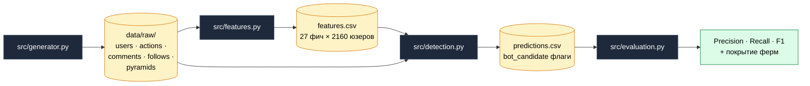

# Bot Farm Detector

> End-to-end пайплайн детекции координированных ботоферм в соцсети:
> синтетические данные → EDA → feature engineering → DBSCAN + Louvain → метрики.
> Сделан как воплощение в код устного ответа на собеседовании
> на позицию **стажёра-аналитика антифрода**.

[](https://www.python.org/)
[](notebooks/)
[](#pipeline)

---

## TL;DR

В синтетическом датасете 2 160 пользователей, из них 160 — боты, организованные
в 5 ферм. Они синхронно подписываются на финансовые пирамиды, оставляют
шаблонные комментарии, делятся IP-подсетями и взаимно подписаны друг на друга.

Два метода работают параллельно, итог сравнивается с ground truth:

| Метод | Precision | Recall | F1 | TP | FP | FN |
|:--|:-:|:-:|:-:|:-:|:-:|:-:|
| **Louvain** на графе подписок и общих /24 подсетей | **1.000** | **1.000** | **1.000** | 160 | 0 | 0 |
| Combined (Louvain ∪ DBSCAN) | 0.856 | 1.000 | 0.922 | 160 | 27 | 0 |
| DBSCAN на поведенческих фичах | 0.325 | 0.081 | 0.130 | 13 | 27 | 147 |

Все 5 реальных ферм идеально склеились в свои Louvain-сообщества
(`dominant_share = 1.0`).

> **Главный инсайт:** добавление слабого метода в OR-ансамбль *ухудшило* F1.
> Combined проиграл одиночному Louvain на 27 ложноположительных без новых
> истинноположительных. Слабый член ансамбля только шумит.

---

## Why this project

Кейс на собеседовании просил *описать словами*, как ловить ботов, подписавшихся
на финансовые пирамиды. После словесного ответа было желание собрать рабочий
артефакт — не просто рассуждать, а показать пайплайн end-to-end.

В отличие от стандартного Kaggle-ноутбука, проект решает три задачи параллельно:

1. **Реализм.** Синтетика собрана так, чтобы воспроизводить настоящие паттерны
   ботоферм (синхронные залпы, шаблонные тексты, кольцевые подписки) — а не
   просто рандом. Часть нормальных юзеров тоже подписывается на пирамиды,
   чтобы метрики не были фейково идеальными.
2. **Честность.** Ground truth (`is_bot`, `bot_cluster_id`) используется
   **только** для финальной оценки. Обучение и кластеризация работают как на
   реальных данных — без меток.
3. **Сторителлинг.** Ноутбуки построены вокруг гипотез из собеседного ответа.
   Часть гипотез (CV интервалов) ломается на этапе EDA — и это разобрано
   отдельно, а не замалчивается.

---

## Architecture



Внутри `detection.py` работают два независимых классификатора:

- **DBSCAN** — на стандартизованных поведенческих фичах. Помечает плотные
  группы; затем оставляем только малые кластеры (10–100 человек), большой =
  «нормальная масса».
- **Louvain** — на взвешенном графе, где рёбра это: (а) подписки между
  юзерами, (б) совместное использование одной /24-подсети. Маленькие
  сообщества с высоким средним `mutual_follow_share` и `duplicate_text_share`
  помечаются как фермы.

Финальный флаг `bot_candidate` = `OR(DBSCAN-кандидат, Louvain-кандидат)`.

---

## Sample output

`python -m src.evaluation` на сгенерированном датасете печатает:

```text
=== Метрики бинарной классификации (vs is_bot) ===
      method  precision  recall     f1   TP  FP   FN    TN
    combined      0.856   1.000  0.922  160  27    0  1973
 dbscan_only      0.325   0.081  0.130   13  27  147  1973
louvain_only      1.000   1.000  1.000  160   0    0  2000

=== Покрытие ферм ===
 bot_cluster_id  size  recall_in_cluster  n_louvain_communities  dominant_share
              0    34                1.0                      1             1.0
              1    27                1.0                      1             1.0
              2    31                1.0                      1             1.0
              3    35                1.0                      1             1.0
              4    33                1.0                      1             1.0
```

`dominant_share = 1.0` для каждой фермы означает, что **все** боты данной
фермы оказались внутри одного и того же Louvain-сообщества — ни один не
утёк в чужой кластер.

---

## Data

### Схема таблиц

| Таблица | Размер | Колонки |
|:--|:-:|:--|
| `users` | 2 160 | `user_id`, `registration_date`, `profile_completeness`, `has_avatar`, `is_bot`, `bot_cluster_id` |
| `actions` | 89 505 | `action_id`, `user_id`, `action_type` (subscribe / like / comment), `target_id`, `ts`, `ip`, `user_agent` |
| `comments` | 18 654 | `action_id`, `user_id`, `target_id`, `ts`, `text` |
| `follows` | 33 715 | `follower_id`, `followed_id`, `ts` |
| `pyramids` | 10 | `target_id`, `name`, `is_pyramid` |

Колонки `is_bot` и `bot_cluster_id` — ground truth, в обучении и кластеризации
не используются.

### Заложенные паттерны ботоферм

| Паттерн в генераторе | Какой сигнал даёт |
|:--|:--|
| 5 кластеров ботов по 20–50 аккаунтов | Размер «подозрительных» Louvain-сообществ |
| Синхронная подписка на пирамиду в окне 5 минут | Всплеск во времени, низкий `min_window_5_sec` |
| Шаблонные комментарии (4 шаблона на ферму) | Высокий `duplicate_text_share` через MinHash |
| 2 общие /24-подсети на ферму | Совместные рёбра в графе Louvain |
| 3 общих User-Agent на ферму | Низкая энтропия UA на уровне фермы |
| Кольцевые подписки внутри фермы (≈70%) | Высокий `mutual_follow_share` |
| Регистрация в окне 14 дней перед атакой | Низкий `account_age_days` |
| Низкий `profile_completeness`, без аватара | Профильные фичи |

---

## Pipeline

| # | Модуль | Что делает |
|:-:|:--|:--|
| 1 | `src/generator.py` | 2 160 пользователей, 89 тыс. действий, 5 ферм по ~30 ботов с заложенными паттернами |
| 2 | `src/features.py` | 27 фич по 5 группам: профиль, активность, технические, тексты (MinHash), граф |
| 3 | `src/detection.py` | DBSCAN + Louvain community detection, объединённые через OR |
| 4 | `src/evaluation.py` | Precision / Recall / F1 vs ground truth, покрытие каждой реальной фермы |

### Группы признаков (27 фич)

| Группа | Примеры | Что отражает |
|:--|:--|:--|
| Профиль | `profile_completeness`, `account_age_days`, `has_avatar` | Статика аккаунта |
| Активность | `pyramid_action_share`, `interval_median`, `min_window_5_sec` | Поведение во времени, бёрсты |
| Технические | `n_unique_subnets`, `ua_entropy`, `ip_entropy` | Концентрация устройств |
| Тексты | `duplicate_text_share`, `mean_text_neighbours` | MinHash-сходство комментариев |
| Граф | `mutual_follow_share`, `following_count`, `followers_count` | Кольцевые подписки |

---

## Notebooks

Каждый ноутбук **уже выполнен** — графики и таблицы внутри, GitHub рендерит
их прямо на странице файла:

| Notebook | Содержание |
|:--|:--|
| [`01_eda.ipynb`](notebooks/01_eda.ipynb) | Распределения профилей, всплески подписок на пирамиды, парадокс CV интервалов, повторяющиеся комментарии, кольцевые подписки |
| [`02_features.ipynb`](notebooks/02_features.ipynb) | Сводка по фичам, `bot vs normal` по средним, корреляции, UMAP-проекция признакового пространства |
| [`03_detection.ipynb`](notebooks/03_detection.ipynb) | Размеры DBSCAN-кластеров, размеры Louvain-сообществ, визуализация подграфа подозрительных кластеров |
| [`04_report.ipynb`](notebooks/04_report.ipynb) | Финальные метрики, матрицы ошибок, выводы и направления улучшений |

---

## Key takeaways

### 1. Парадокс CV

Гипотеза из устного ответа: «у ботов интервалы между действиями слишком ровные,
значит CV `std/mean` будет низким». На реальных данных гипотеза **сломалась**:
у ботов CV получился ≈6, у нормы ≈1.

Причина — смесь двух режимов: бот делает фоновое расписание (раз в 30 минут,
интервалы ровные) **плюс** залп из 3 действий за минуту во время атаки на
пирамиду. Смесь раздувает дисперсию, а наивная метрика её не различает.

Замена: `interval_median` (у ботов 2 000 сек vs 130 000 у нормы),
`interval_p10` и `min_window_5_sec` ловят бёрсты напрямую.

### 2. Louvain победил DBSCAN с разгромным счётом

DBSCAN ожидает, что бот-сигнал — *градиентный* в пространстве фич. На наших
данных он **структурный**: кольцевые подписки и общие IP. Louvain ловит это
естественно через топологию графа; DBSCAN либо сливает ботов в один
гигантский кластер с нормой, либо ловит крошечные очаги.

Урок: алгоритм должен соответствовать форме сигнала, а не выбираться
«потому что популярный».

### 3. Ансамбль ради ансамбля — антипаттерн

`OR(DBSCAN, Louvain)` дал **более низкий** F1, чем Louvain в одиночку:
27 ложноположительных без новых истинноположительных. Если один член
ансамбля заметно слабее другого, OR только шумит. На проде нужна
взвешенная схема или мета-классификатор поверх предсказаний обоих.

---

## Honest limitations

Чтобы рекрутер не строил иллюзий — что в этом проекте *идеализировано*:

- **Идеальный recall = синтетика.** Все 5 ферм поймались, потому что я их сам
  и создал. На реальных данных ферм будет десятки разных «школ», часть
  замаскируется лучше — recall неизбежно просядет.
- **70% кольцевых подписок** внутри фермы — это сильный сигнал. В живых
  данных доля будет ближе к 30–50%, и Louvain перестанет давать единичку.
- **1 IP / 1 UA на нормального юзера** — упрощение генератора. В реальности
  у обычного человека 2–3 устройства; разделение по `n_unique_subnets`
  работает за счёт этого слишком хорошо.
- **MinHash на 4 шаблонах** — попадание гарантировано. На нюансированных
  текстах (одна и та же мысль разными словами) MinHash проседает; нужен
  будет sentence-embedding-based dedup.
- **Нет временного дрейфа.** Реальные фермы эволюционируют — паттерны,
  которые работают сегодня, через месяц не работают. Здесь снапшот.
- **Нет adversarial-тестирования.** Не проверял, что будет, если бот-фарм
  узнает о моих фичах и начнёт под них подстраиваться.

Эти ограничения — не баги, а **граница ответственности учебного проекта**.
В разделе ниже — что добавил бы на реальном продакшене.

---

## What real production would need

- **Semi-supervised слой:** ручная разметка топ-N кандидатов аналитиком →
  CatBoost / XGBoost на фичах, обученный на этих метках. Так Louvain
  становится recall-ловушкой, а градиентный буст — precision-фильтром.
- **Скользящее временное окно** (последние 7/30 дней) вместо анализа всего
  лога. Адаптивно к дрейфу.
- **Метаклассификатор** поверх предсказаний обоих методов вместо OR.
  Минимум — логистическая регрессия с признаками-выходами от DBSCAN
  и Louvain.
- **Мониторинг качества** в проде: precision-at-N по ручной разметке
  «топ-100 подозрительных» каждый день — единственный способ ловить
  деградацию без ground truth.
- **Feedback loop:** действия модераторов (бан / снятие бана) →
  обратно в обучающую выборку.
- **SQL-витрина** с базовыми эвристиками (`pyramid_subs_in_5min > X`,
  `subnet_collision_count > Y`) для быстрых ad-hoc проверок аналитиком.

---

## Setup

```bash
git clone git@github.com:SEWTY9/first-bfd.git
cd first-bfd
pip install -r requirements.txt
```

### Воспроизвести pipeline с нуля (~1 минута)

```bash
python -m src.generator    # data/raw/*.csv
python -m src.features     # data/processed/features.csv
python -m src.detection    # data/processed/predictions.csv
python -m src.evaluation   # печатает метрики
```

### Пересобрать ноутбуки после правок

```bash
python scripts/build_notebooks.py
jupyter nbconvert --to notebook --execute --inplace notebooks/*.ipynb
```

---

## Project structure

```
first-bfd/
├── README.md                  # вы здесь
├── requirements.txt
│
├── src/
│   ├── generator.py           # синтетика
│   ├── features.py            # 27 фич по 5 группам
│   ├── detection.py           # DBSCAN + Louvain
│   └── evaluation.py          # метрики
│
├── notebooks/
│   ├── 01_eda.ipynb
│   ├── 02_features.ipynb
│   ├── 03_detection.ipynb
│   └── 04_report.ipynb
│
├── scripts/
│   └── build_notebooks.py     # программная сборка .ipynb через nbformat
│
└── data/
    ├── raw/                   # users / actions / comments / follows / pyramids
    └── processed/             # features.csv / predictions.csv
```

CSV-файлы в `data/` не коммитятся (см. `.gitignore`) — генерируются
из `src/generator.py` за пару секунд.

---

## Stack

`pandas` · `numpy` · `networkx` · `scikit-learn` · `datasketch` (MinHash) ·
`python-louvain` · `umap-learn` · `matplotlib` · `seaborn` · `faker`

---

## Author

Глеб Графов — кандидат на стажировку аналитика антифрода.
[grafovg99@gmail.com](mailto:grafovg99@gmail.com)
